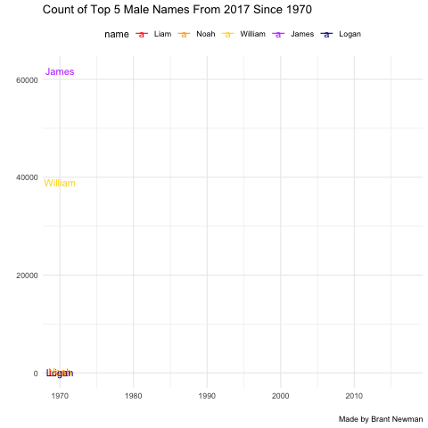

```{r setup, include=FALSE}
knitr::opts_chunk$set(echo = TRUE, error=TRUE, message=FALSE, warning=FALSE)
```

```{r libraries}
library(tidyverse)     # for graphing and data cleaning
library(lubridate)     # for date manipulation
library(ggthemes)      # for even more plotting themes
theme_set(theme_minimal()) # My favorite ggplot() theme :)
```

## Data choice 1: Baby Names

```{r}
# Read in the data

# Or read in the data manually

babynames <- readr::read_csv('https://raw.githubusercontent.com/rfordatascience/tidytuesday/master/data/2022/2022-03-22/babynames.csv')


# If the code above gives an error, uncomment the code below and use it instead. 
# You will need to install the tidytuesdayR package first.

# library(tidytuesdayR)
# 
# tuesdata <- tidytuesdayR::tt_load('2022-03-22')
# tuesdata <- tidytuesdayR::tt_load(2022, week = 12)
# 
# babynames <- tuesdata$babynames
```

This week's data should be familiar from previous exercises. There is data for both babynames from New Zealand and the US. Read more about it, including definitions of variables, [here](https://github.com/rfordatascience/tidytuesday/blob/master/data/2022/2022-03-22/readme.md). 

```{r}
new_babynames <- babynames %>% 
  filter(sex %in% c("M")) %>% 
  filter(year >= 1970) %>% 
  filter(name %in% c("Liam", "Noah", "William", "James", "Logan"))
```

```{r, fig.alt = "Animated graph showing the count of the top five 2017 names since 1970. James and William started out high, but leveled out and are now pretty much even with Liam, Noah, and Logan."}
new_babynames %>% 
  ggplot(aes(x = year, 
             y = n,
             color = name)) +
  geom_line() +
  geom_text(aes(label = name)) +
  labs(title = "Count of Top 5 Male Names From 2017 Since 1970", 
       caption = "Made by Brant Newman",
       x = "",
       y = "",
       color = "name") +
  scale_color_manual(values = c("Liam" = "red",
                       "Noah" = "orange",
                       "William" = "gold1",
                       "James" = "darkorchid1",
                       "Logan" = "navyblue")) +
  theme(legend.position = "top") +
  transition_reveal(year)
```

```{r}
anim_save("top_names2017.gif")
```

```{r, fig.alt = "Animated graph showing the count of the top five 2017 names since 1970. James and William started out high, but leveled out and are now pretty much even with Liam, Noah, and Logan."}

```

